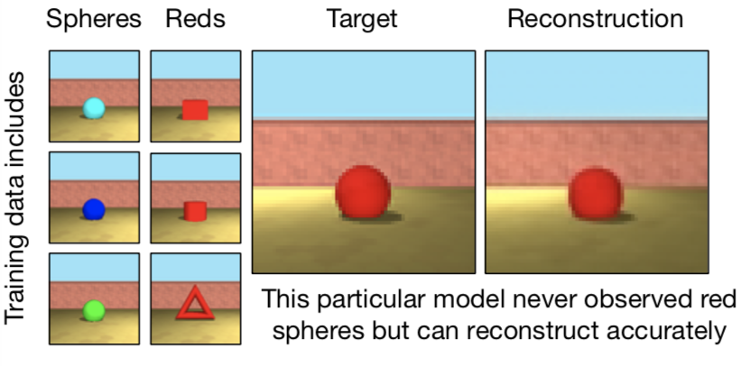

## 前言

Generative Query Network(GQN)是由DeepMind在2018年提出的一个非监督的生成网络. 这是一个基于场景的(scene-based)方法, 让机器人根据之前搜集的场景信息从相关的视角(viewpoint)信息来推断出查询视角的图像. 由于它的非监督的性, GQN提供了一种让机器人(agent)可以自己学习理解周围环境的方法.

GQN 主要由3个网络结构构成: 表示结构(representation architecture), 生成结构(generative architecture), 以及推断结构(inference architecture). 表示结构以不同视角的图片作为输入, 输出一系列低纬度的抽象表示(representation), 基于这些抽象表示, 生成网络可以生成一个基于新视角的图片. 推断结构可以看作是VAE中的编码器(encoder), 它提供了一个可以非监督地训练前两个结构的一种方法.

接下来让我们来深入研究下这三种结构.

## 表示结构

表示结构通过抓住一些最重要的部分来在一个简单的表示(representation)上描述场景的布局, 例如对象位置, 颜色, 房间的结构等等. 

对于每一个场景 i, 表示结构的输入包含了在那个场景下不同视角所观察到的图片 $ \mathbf x_i^{1,\dots,M} $ 以及观察到这些图片的视角信息 $\mathbf v_i^{1, \dots, M}$. 每个视角 $\mathbf v_i^k$ 由一个7维向量组成
$$
\mathbf v^k = \left(\mathbf w, \cos(\mathbf y^k), \sin(\mathbf y^k), \cos(\mathbf p^k), \sin(\mathbf p^k) \right)
$$
其中 $\mathbf w$ 是相机(在机器人上)的$x, y, z$ 坐标, $\mathbf y$ 和 $\mathbf p$ 是分别是相机绕 y 轴转的偏航角(yaw) 和绕 z 轴转的仰俯角 (pitch).

将每组图片 $\mathbf x_i^k$ 和视角信息 $\mathbf v_i^k$ 作为输入, 放到表示网络中我们会得到一个表示, 将所有表示加起来我们得到了最终基于场景 $i$ 的表示:
$$
\begin{align}
\mathbf r^k&=\psi(\mathbf x^k, \mathbf v^k)\\
\mathbf r &= \sum_{k=1}^M \mathbf r^k
\end{align}
$$
对于网络 $\psi$, 作者们提出了下面3种结构

在实验中他们发现第二种Tower结构学的最快并且能很好的外推. 我们把对这些表示的进一步讨论留到最后的附录中.

## 生成器

在训练过程中, 生成器(generator) 学习环境中的主要对象(typical objects), 特征(features), 关系(relationships), 和规则(regularities). 这些共享的信息可以让表示结构去学习用一些高层的抽象来表示每个场景, 而把细节填充留给生成器.

生成器是一个卷积LSTM的扩展网络, 它的输入包括1. 查询的视角信息$\mathbf v^q$, 2. 表示结构 — 基于同场景不同视角生成的表示$\mathbf r$, 3. 一个潜变量向量(latent variable vector)$\mathbf z$. 最后生成查询的视角关联的图片 $\mathbf x^q$. 下图显示生成器的网络结构

对于上图每一个卷积 LSTM cell, 它的查询视角信息 $\mathbf v^q$ 和表示 $\mathbf r$ 都是一样的. 而潜变量向量 $\mathbf z_i$ 是从hidden state $h_l^g$ 中提取的. 更准确的说, $\mathbf z_i$ 是取样自前验高斯分布 $ \pi_{\theta}(\mathbf z_l|\mathbf v^q,\mathbf r, \mathbf z_{< l})=\mathcal N (\mathbf z_l|\eta_{\theta}^\pi( h_l^g)) $, 高斯分布的均值和方差都由上图中的卷积网络 $ \eta_\theta^\pi(h_l^g) $ 生成.

生成的图像采样自高斯分布 $ g_{\theta}(\mathbf x^q|\mathbf z, \mathbf v^q,\mathbf r) = \mathcal N (\mathbf x^q|\mu=\eta_\theta^g(\mathbf u_L), \sigma=\sigma_t) $, 其中均值是上图中的卷积网络 $ \eta_\theta^g(u_l) $, 方差是一个常数, 随着训练慢慢的减小(anneal)到 0.7. 作者们解释, 这种逐渐减小的方差鼓励模型在开始的时候将注意力放在大规模的预测问题上, 在最后的时候才把注意力转到底层地细节(low-level details)上.

下面我们简单了解下每一个卷积 LSTM cell 里发生的事:

1. 连接 $ \mathbf v^q,\mathbf r, \mathbf z_l $ 到hidden state $\mathbf h_l^g$
2. 用连接好的张量生成LSTM的3个 gate(图中$\mathrm{sigmoid}$) 和 candidate values(图中$\tanh$)
3. 更新 cell state 和 hidden state
4. 通过转置卷积层向上采样hidden state, 把结果加到$u_l$上. 注意这里的 $u_l$ 是慢慢的构建成的, 这意味着我们最后的生成图片也是一点一点慢慢构建成的.

## 推断结构

推断结构(inference architecture)其实很像VAE中的编码器(encoder), 它主要被用来近似潜变量的分布(这里我们可以把生成网络中的 $\pi_{\theta}(\mathbf z_l|\mathbf v^q,\mathbf r, \mathbf z_{< l})$ 看成VAE中潜变量的前验分布), 从而训练其他两个网络.

推断结构以表示 $\mathbf r$, 查询视角信息 $\mathbf v^q$, 以及查询的图片 $\mathbf x^q$ 作为输入, 输出潜变量后验概率 $ q_\phi(\mathbf z|\mathbf x^q,\mathbf v^q,\mathbf r) $. 这个后验概率同样是一个高斯分布用来近似生成网络中的 $ \pi_\theta(\mathbf z|\mathbf v^q, \mathbf r) $. 由于论文中没有推断结构的网络结构图, 我根据自己的理解自己画了一个

推断网络也是一个卷积LSTM, 不同于生成网络, 这里没有 $u$. 它生成潜变量的后验概率 $ q_\phi(\mathbf z|\mathbf x^q,\mathbf v^q,\mathbf r) $ 传递给生成器.

## 优化

GQN的损失函数基本等同于VAE的损失函数, 推导自变分推断(variational inference), 都是最大化Evidence Lower BOund (ELBO). 下面我们直接给出最终的损失函数, 和往常一样, 我们取负值用以最小化
$$
\mathcal L(\theta, \phi) = E_{(\mathbf x, \mathbf v)\sim D, z\sim q_\phi}\left[-log\mathcal N(x^q|\eta_\theta^g(\mathbf u_L)) + \sum_{l=1}^L D_{KL}[\mathcal N(\mathbf z|\eta_\phi^q(\mathbf h_l^e))\Vert\mathcal N(\mathbf z|\eta_\theta^\pi(\mathbf h_l^g))] \right]
$$
我们简单介绍下上式各项: 

1. 第一部分是重构的log likelihood. 它衡量生成器生成查询图像的概率, 注意我们的 $z$ 是取自推断网络输出的后验概率 $ q_\phi(\mathbf z|\mathbf x^q,\mathbf v^q,\mathbf r) $, 这解释了为什么生成器在训练时能生成我们想要的查询图像 $\mathbf x^q $. 同样因为 $z$ 取自后验概率 $ q_\phi(\mathbf z|\mathbf x^q,\mathbf v^q,\mathbf r) $, 生成器中 $ \eta^\pi_\theta $ 并不会受这部分损失函数影响.
2. 第二部分的KL散度将生成器中的 $ \pi_\theta(\mathbf z_l|\mathbf v^q,\mathbf r, \mathbf z_{< l}) $ 和推断网络输出的 $q_\phi(\mathbf z_l|\mathbf x^q, \mathbf v^q, \mathbf r, \mathbf z_{< l})$ 相互逼近. 由于两者都是高斯分布, 我们可以求得他们的闭合解(close-form solution):

$$
D_{KL}\left(\mathcal N(\mathbf z |\mu_1,\sigma_1)\Vert \mathcal N(\mathbf z |\mu_2,\sigma_2)\right)=\sum_{j=1}^J\left(\log{\sigma_{2,j}\over \sigma_{1,j}}+{\sigma_{1,j}^2+\left(\mu_{1,j}-\mu_{2,j}\right)^2\over 2\sigma_{2,j}^2}-{1\over 2}\right)
$$

## 算法伪代码

### 损失函数

为了计算ELBO, 我们先构建表示 $\mathbf r$, 然后我们通过生成器和推断结构逐步计算KL散度. 最后我们加入重构的log likelihood来得到最终的ELBO.

### 训练

在每次的训练迭代中, 我们先选择一组场景. 对每个场景, 我们从训练集中采样一组视角和与之关联的图片, 以及一个查询视角和查询视角所关联的图片. 然后我们计算我们的损失函数, 然后通过Adam来进行优化

### 生成预测

在生成预测阶段, 我们先选取一组视角信息来计算表示 $\mathbf r$, 然后我们通过生成网络来得到一个最终图片的高斯分布. 

## 附录

### 场景表示的一些性质

下面我们展示表示结构生成的表示 $\mathbf r$ 的一些性质

- 通过下面 T-SNE 生成的分布图我们可以看到, 尽管同一场景的不同的视角包含着差异很大的图片, GQN的场景表示 $\mathbf r$ 还是表现出了明显的基于场景的分类(clustering of images of the same scene)

  

-  $\mathbf r$ 还表现出组合的行为(compositional behavior): 他可以表示并生成一些它从来没有看到过的组合图片

- 诸如对象颜色, 形状, 大小等场景的性质都被很好的分开表示(factorized) — 改变其中一个仍然能保留相似度较高的表示

- $\mathbf r$ 可以计算一些场景代数(scene algebra). 通过加/减相关场景的表示, 我们可以控制对象场景的的性质.

  

## 最后

有些中文翻译可能有些生硬, 英文版可以移步我的个人博客: https://xlnwel.github.io/blog/representation%20learning/GQN/

### 参考文献

S. M. Ali Eslami, et al, from DeepMind. Neural scene representation and rendering